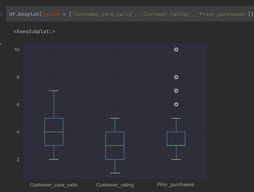
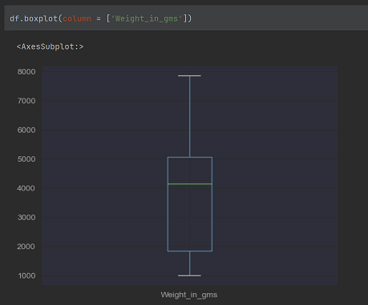
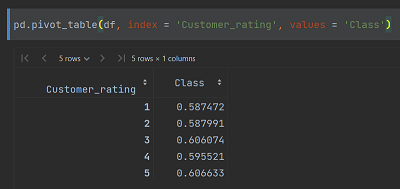
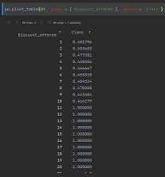
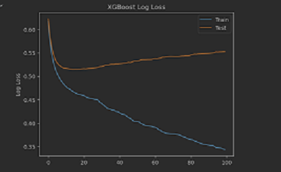
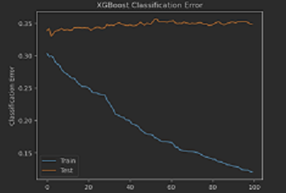
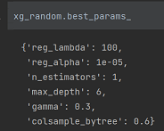
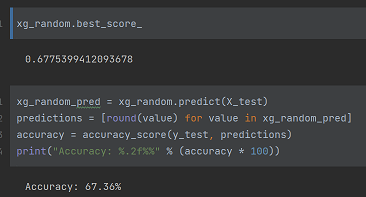

# E-commerce Shipping Predictor
## Overview
This project focuses on building a predictive classification model for the e-commerce shipping industry. The goal is to classify shipments as delivered on time or not by leveraging customer and shipment data obtained from an e-commerce 'company'. 
* A tool to predict the on-time delivery of a package shipped by a company, described as: Yes or No, the package will be delivered on time.
* Dataset of 11,000 packages shipped containing package and customer information.
* Tested many different classification algorithms including Naive Bayes-Gaussian, Logistic Regression, KNN, SVM, Random Forest, and Gradient Boosting.
* Optimized XGBoost Classifier to reach a model with an accuracy of 67%.
* Built and integrated model into RESTful API using Flask.

## Motivation
The motivation behind this project is to help an international e-commerce company to gain key insights by employing advanced machine learning techniques to analyze customer data and enhance their understanding of customer behavior. By exploring various machine learning models and tuning techniques, the objective is to identify the best performing model that can accurately predict whether or not a shipment will be delivered on time. 

## Data Collection and Cleaning
The dataset used for this project consists of customers and shipped product information obtained from Kaggle. It comprises data from approximately 11,000 customers and their associated shipments. Fortunately, the dataset required minimal cleaning and preprocessing, allowing for EDA and model building right away.

## Exploratory Data Analysis (EDA)
Before proceeding with the model building phase, an exploratory data analysis (EDA) was conducted to gain a better understanding of the dataset. 
The follow aspects were explored:
* Data types of the variables.
* Distributions of Customer Care Calls, Customer Ratings, Prior Purchases, Discounts Offered, and Package Weights.
* The spread of aforementioned variables as well as outliers.
* Correlations between each variable using a heatmap.
* Comparisons of categorical variables.
* Analysis of delivered shipments in relation to independent variables using pivot tables.

 
 

 

## Model Exploration and Building
Since the problem at hand involved classification, a range of classification models were explored.
These models included:
* Gradient Boost (XGBoost) - Usually the best performing and used as a baseline.
* Light Gradient Boost - Faster and more optimal than XGBoost, used to compare XGBoost.
*  Naive Bayes-Gaussian - Very reliable and simple classification algorithm.
*  Logistic Regression - Commonly used for binary classification.
*  K-Nearest Neighbors (KNN) - Simple but was not expecting much with this limited dataset.
*  Support Vector Machine (SVM) - Again, more useful in datasets that are larger, but curious as to how it would perform.

The objective was to experiment with models that I had not previously encountered and evaluate their performance. 

## Model Testing
Once the models were trained, they were tested and evaluated using various metrics. The Mean Absolute Error (MAE) was recorded as well as the negative mean absolute error using cross-validation. Additionally, the accuracy score for each model was calculated to asses their performance.
Here is how each model performed:
 
| Model                   | MAE  | CV Score | Training Accuracy | Testing Accuracy |
|:------------------------|:-----|:---------|:------------------|:-----------------|
| XGBoost                 | 0.35 | -0.35    |       88%         |       65%        |
| Light Gradient Boost    | 0.34 | -0.34    |       81%         |       66%        |
| Naive Bayes-Gaussian    | 0.36 | -0.35    |       65%         |       64%        |
| Logistic Regression     | 0.37 | -0.37    |       63%         |       63%        |
| K-Nearest Neighbor      | 0.36 | -0.36    |       77%         |       64%        |
| Support Vector Machine  | 0.36 | -0.38    |       92%         |       64%        |

## Evaluation of Best Model
The XGBoost model demonstrated the best performance based on evaluation metrics. To further enhance its performance, a deeper analysis of the model was conducted. Log-loss was evaluated to identify potential overfitting issues and determine the appropriate number of stopping rounds for training. Moreover,
the model was fine-tuned by adjusting the learning rate and estimators to maximize performance. Both Gridsearch and Randomsearch cross-validation techniques were employed to identify the optimal parameters.

 

 

 

 

 

## Code and Resource Reference
**Python Version:** 3.9

**Packages:** Pandas, Numpy, Sklearn, Lightgbm, XGBoost, Matplotlib, Seaborn, Flask, Json, Pickle

**Web Framework Requirements:** '''pip install -r requirements.txt'''

**Kaggle Dataset:** https://www.kaggle.com/datasets/ulrikthygepedersen/shipping-ecommerce

**Flask Production:** https://towardsdatascience.com/productionize-a-machine-learning-model-with-flask-and-heroku-8201260503d2

## Putting the Model Into Production
In order to gain practical experience in deploying the model, a Restful API was implemented using Flask. The API was set up locally for testing purposes. With the API, clients can send requests with the required parameters and receive a binary response indicating whether the package will be delivered on time or not. The model achieved a testing accuracy of 67% in this production environment.

## Conclusion, Thoughts and Considerations
Through this project I achieved the following:
* Conducted EDA gaining insight on customer data.
* Explored five new machine learning algorithms and measured their performance.
* Evaluated best performing model, tuning using various techniques to maximize performance and accuracy.
* Simulated putting the model into production and testing locally for evaluation. 

During this project I acquired valuable lessons and considerations:
* Trends, patterns and correlations were discovered when looking at delivery statuses and customer history.
* Classification regression is very useful, especially in a binary context. 
* Understanding Log-loss and how it affects a model's training.
* Implementing cross-validations techniques can estimate the best parameters to employ.
* Integrating a model into a Restful API is critical to enhance a company and their resources. 

Although the model achieved some level of accuracy, it falls short of the desired performance possibly due to overfitting. Future improvements could involve incorporating backwards elimination to determine if the model can be enhanced further. Overall, this project provides a valuable opportunity to work with predictive classification models in the context of shipping commerce and exploring advanced machine learning techniques. 
